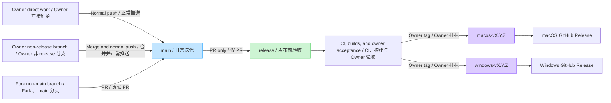

# Contributing to ShotPaste / 参与 ShotPaste 贡献

Thank you for helping improve ShotPaste. Contributions may target either
native client, shared localization, documentation, scripts, or release quality.

## Before you start

- Search existing issues and pull requests.
- Open an issue before a large feature, dependency, data-format, or architecture
  change.
- Keep pull requests focused. Shared product behavior should remain aligned on
  macOS and Windows unless an operating-system difference requires otherwise.
- Never include credentials, signing certificates, captured private content, or
  unsanitized logs and screenshots.
- You are responsible for reviewing and testing every submitted change,
  including code, translations, tests, or documentation produced with automated
  tools.

Security vulnerabilities belong in the private process described in
[SECURITY.md](SECURITY.md), not in a public issue.

## Set up the project

Follow [docs/DEVELOPMENT.md](docs/DEVELOPMENT.md). Platform code must be built
and tested on its native operating system:

- macOS: Swift, SwiftUI, and AppKit under `platforms/mac`
- Windows: C#, WPF, and Win32 under `platforms/windows`

The clients use different native stacks but aim to preserve the shared product
behavior in [docs/FEATURES.md](docs/FEATURES.md).

To enable the optional staged-Swift formatting check:

```bash
git config core.hooksPath scripts
```

Remove the local setting with `git config --unset core.hooksPath`.

## Validate a change

macOS baseline:

```bash
./scripts/format.sh
swift -module-cache-path build/swift-module-cache platforms/mac/Tools/Localization/CatalogTool.swift verify
./scripts/run-tests.sh
./scripts/build_and_run.sh build
./scripts/build_and_run.sh build --configuration Release
```

Windows PowerShell baseline:

```powershell
./scripts/build-windows.ps1 -Configuration Debug
```

A successful compile is not sufficient for capture, recording, permission,
shortcut, DPI, or window-management changes. Include the affected OS/hardware
and concise manual acceptance steps in the pull request.

## Branch management / 分支管理

### English

ShotPaste uses `main` for daily development and `release` for pre-release
acceptance. The repository owner maintains the project directly; pull requests
remain the contribution path for everyone else.

1. The repository owner may commit and push directly to `main`, or merge any
   non-`release` branch into `main` and push the result. A pull request into
   `main` is optional for owner-maintained work.
2. Normal pushes to `main` are allowed. Force-pushing or deleting `main` is
   prohibited.
3. External contributors must fork the repository, create a focused branch
   other than `main` in their fork, and open a pull request from that branch to
   the upstream `main`. External contributions do not target `release`.
4. `release` accepts changes only through pull requests. Direct commits and
   direct pushes to `release`, force-pushing it, and deleting it are prohibited.
5. To prepare a release, the repository owner opens a pull request from `main`
   to `release`. Do not cherry-pick selected changes or apply a hotfix directly
   to `release`; complete the change on `main` first and use the same
   `main`-to-`release` path.
6. After the pull request is merged, the resulting `release` commit must pass
   the applicable builds and CI checks for both native platforms. The repository
   owner must also complete manual acceptance before creating a tag.
7. Only an accepted commit on `release` may receive an immutable official tag:
   `macos-vMAJOR.MINOR.PATCH` or `windows-vMAJOR.MINOR.PATCH`. Each tag triggers
   only its platform's release workflow and GitHub Release.

### 中文

ShotPaste 使用 `main` 作为日常迭代分支，使用 `release` 作为发布前验收分支。
项目由仓库 Owner 直接维护，其他贡献者统一通过 Pull Request 贡献代码。

1. 仓库 Owner 可以直接在 `main` 提交并正常推送，也可以将任意非 `release`
   分支合入 `main` 后推送；Owner 自己维护的改动不强制要求 Pull Request。
2. `main` 允许正常推送，但禁止强制推送，也禁止删除。
3. 外部贡献者必须先 fork 仓库，在自己的 fork 中创建一个非 `main`、职责单一
   的分支，然后从该分支向上游 `main` 发起 Pull Request。外部贡献不得直接
   以 `release` 为目标分支。
4. `release` 只允许通过 Pull Request 合入。禁止直接在 `release` 提交或
   推送，禁止强制推送，也禁止删除。
5. 需要发版时，由仓库 Owner 从 `main` 向 `release` 发起 Pull Request。
   不再通过 cherry-pick 挑选提交，也不直接在 `release` 修复；任何修复都先
   进入 `main`，再沿用 `main` 到 `release` 的流程。
6. Pull Request 合并后，`release` 上的候选提交必须通过两个原生平台适用的
   构建与 CI 检查，并由仓库 Owner 完成人工验收，之后才能创建 tag。
7. 只有 `release` 上已经验收通过的提交可以创建不可变的正式 tag：
   `macos-vMAJOR.MINOR.PATCH` 或 `windows-vMAJOR.MINOR.PATCH`。每个 tag 只
   触发对应平台的发布工作流和 GitHub Release。

### Promotion flow / 分支推进示意图



## Pull requests

1. External contributors fork the repository and create a non-`main` branch
   from the latest `main` for one coherent change.
2. Open the contribution pull request against the upstream `main`; do not target
   `release`.
3. A release pull request is maintained by the repository owner and must use
   `main` as its source and `release` as its target.
4. Add or update tests and user-facing documentation where relevant.
5. Validate every changed native platform on that operating system.
6. Complete the pull request template with exact evidence and known limits.

Pull requests are reviewed for correctness, privacy impact, platform parity,
accessibility, localization, and maintainability. A passing CI run is necessary
but does not replace native-platform testing for UI, capture, recording,
permissions, shortcuts, DPI, or signing behavior.

Maintainers may ask for a smaller change, additional evidence, or a platform
follow-up before merging. Draft pull requests are welcome when early design
feedback would prevent wasted work.

Do not mix generated artifacts, unrelated formatting, or personal IDE files
into the change. By contributing, you agree that your contribution is licensed
under the repository's [BSD 3-Clause License](LICENSE).
