# Contributing to ShotPaste / 参与 ShotPaste 贡献

Thank you for helping improve ShotPaste. Contributions may target either
native client, shared localization, documentation, scripts, or release quality.

## Before you start

- Search existing issues and pull requests.
- Open an issue before a large feature, dependency, data-format, or architecture
  change.
- Keep pull requests focused. Shared product behavior should remain aligned on
  macOS and Windows unless an operating-system difference requires otherwise.
- Never include credentials, signing certificates, captured private content, or
  unsanitized logs and screenshots.
- You are responsible for reviewing and testing every submitted change,
  including code, translations, tests, or documentation produced with automated
  tools.

Security vulnerabilities belong in the private process described in
[SECURITY.md](SECURITY.md), not in a public issue.

## Set up the project

Follow [docs/DEVELOPMENT.md](docs/DEVELOPMENT.md). Platform code must be built
and tested on its native operating system:

- macOS: Swift, SwiftUI, and AppKit under `platforms/mac`
- Windows: C#, WPF, and Win32 under `platforms/windows`

The clients use different native stacks but aim to preserve the shared product
behavior in [docs/FEATURES.md](docs/FEATURES.md).

To enable the optional staged-Swift formatting check:

```bash
git config core.hooksPath scripts
```

Remove the local setting with `git config --unset core.hooksPath`.

## Validate a change

macOS baseline:

```bash
./scripts/format.sh
swift -module-cache-path build/swift-module-cache platforms/mac/Tools/Localization/CatalogTool.swift verify
./scripts/run-tests.sh
./scripts/build_and_run.sh build
./scripts/build_and_run.sh build --configuration Release
```

Windows PowerShell baseline:

```powershell
./scripts/build-windows.ps1 -Configuration Debug
```

A successful compile is not sufficient for capture, recording, permission,
shortcut, DPI, or window-management changes. Include the affected OS/hardware
and concise manual acceptance steps in the pull request.

## Branch management / 分支管理

### English

ShotPaste uses `main` as its integration branch and `release` as its stable
source branch. The two native clients may publish at different times and use
independent versions, but every commit on `release` must leave both platform
source trees buildable and free of blocking defects.

1. Create `feature/*`, `fix/*`, `docs/*`, or another focused topic branch from
   the latest `main`.
2. Every topic branch must enter `main` through a pull request. `main` must
   build, run, and contain no blocking defects, but it may contain work that is
   not yet selected for a stable release.
3. Never push directly to `main` or `release`, force-push either branch, or
   delete either branch.
4. To prepare a release, create `promote/macos-vX.Y.Z` or
   `promote/windows-vX.Y.Z` from `release`, then cherry-pick only the completed
   squash commits selected from `main`. Open a pull request from that promotion
   branch into `release`. A direct `main` to `release` pull request is permitted
   only when every difference between the branches is release-ready.
5. Promotion pull requests must pass both platform CI jobs. Shared resources,
   localization, scripts, and formats must remain compatible with the platform
   that is not being published.
6. After a promotion is merged, only the repository owner may create the
   immutable official tag: `macos-vMAJOR.MINOR.PATCH` or
   `windows-vMAJOR.MINOR.PATCH`. Each tag triggers only its platform's release
   workflow and GitHub Release.
7. Create urgent fixes from `release` as `hotfix/*`, merge them back through a
   pull request, publish the affected platform, and then forward-port the fix to
   `main` through another pull request.

### 中文

ShotPaste 使用 `main` 作为日常集成分支，使用 `release` 作为稳定源码分支。
macOS 与 Windows 可以在不同时间发布并使用独立版本号，但 `release` 上的每个
提交都必须保证两个平台的源码可以构建，并且不存在阻塞性缺陷。

1. 从最新 `main` 创建 `feature/*`、`fix/*`、`docs/*` 或其他职责单一的主题
   分支。
2. 所有主题分支都必须通过 Pull Request 合入 `main`。`main` 必须能够构建、
   运行且没有阻塞性缺陷，但可以包含尚未被选入稳定版本的迭代内容。
3. 禁止直接推送到 `main` 或 `release`，禁止强制推送，也禁止删除这两个分支。
4. 准备发布时，从 `release` 创建 `promote/macos-vX.Y.Z` 或
   `promote/windows-vX.Y.Z`，只 cherry-pick 从 `main` 中选定且已经完成的
   squash commit，然后通过 Pull Request 合入 `release`。只有当 `main` 与
   `release` 之间的全部差异都达到发布标准时，才允许直接提交
   `main` 到 `release` 的 Pull Request。
5. 发布推进 Pull Request 必须通过双平台 CI。公共资源、本地化、脚本和数据
   格式必须继续兼容本次未发布的平台。
6. 发布推进合并后，只有仓库 Owner 可以创建不可变的正式 tag：
   `macos-vMAJOR.MINOR.PATCH` 或 `windows-vMAJOR.MINOR.PATCH`。每个 tag 只
   触发对应平台的发布工作流和 GitHub Release。
7. 紧急修复应从 `release` 创建 `hotfix/*`，通过 Pull Request 合回
   `release`，发布受影响的平台，然后再通过另一个 Pull Request 将修复同步
   回 `main`。

### Promotion flow / 分支推进示意图

```mermaid
flowchart LR
    topic["Topic branch / 主题分支"]
    mainBranch["main / 可运行集成"]
    macPromotion["macOS promotion / macOS 发布推进"]
    windowsPromotion["Windows promotion / Windows 发布推进"]
    releaseBranch["release / 稳定源码"]
    macTag["macos-vX.Y.Z"]
    windowsTag["windows-vX.Y.Z"]
    macRelease["macOS GitHub Release"]
    windowsRelease["Windows GitHub Release"]

    topic -->|"PR and CI / 评审与检查"| mainBranch
    mainBranch -->|"Select macOS commits / 选择 macOS 提交"| macPromotion
    mainBranch -->|"Select Windows commits / 选择 Windows 提交"| windowsPromotion
    macPromotion -->|"PR and full CI / 双平台检查"| releaseBranch
    windowsPromotion -->|"PR and full CI / 双平台检查"| releaseBranch
    releaseBranch -->|"Owner tag / Owner 打标"| macTag
    releaseBranch -->|"Owner tag / Owner 打标"| windowsTag
    macTag --> macRelease
    windowsTag --> windowsRelease

    style mainBranch fill:#C2E5FF,stroke:#3DADFF
    style releaseBranch fill:#CDF4D3,stroke:#66D575
    style macTag fill:#DCCCFF,stroke:#874FFF
    style windowsTag fill:#DCCCFF,stroke:#874FFF
```



## Pull requests

1. Branch from `main` and make one coherent change.
2. Add or update tests and user-facing documentation where relevant.
3. Validate every changed native platform on that operating system.
4. Complete the pull request template with exact evidence and known limits.

Pull requests are reviewed for correctness, privacy impact, platform parity,
accessibility, localization, and maintainability. A passing CI run is necessary
but does not replace native-platform testing for UI, capture, recording,
permissions, shortcuts, DPI, or signing behavior.

Maintainers may ask for a smaller change, additional evidence, or a platform
follow-up before merging. Draft pull requests are welcome when early design
feedback would prevent wasted work.

Do not mix generated artifacts, unrelated formatting, or personal IDE files
into the change. By contributing, you agree that your contribution is licensed
under the repository's [BSD 3-Clause License](LICENSE).
