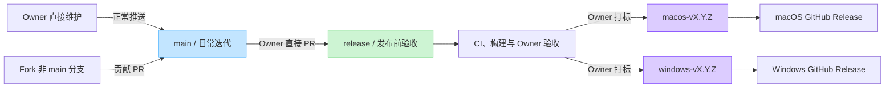

# 参与 ShotPaste 贡献

欢迎改进任一原生客户端、共享本地化、文档、脚本或发布质量。

## 开始之前

- 搜索已有 Issue 和 Pull Request。
- 大型功能、依赖、数据格式或架构变更前先发起 Issue。
- 保持 PR 聚焦。除操作系统差异所必需外，macOS 与 Windows 的共享产品行为应保持一致。
- 不包含凭据、签名证书、捕获的私密内容，以及未脱敏日志或截图。
- 贡献者负责审查和测试所有提交内容，包括自动化工具生成的代码、翻译、测试和文档。

安全漏洞通过 [SECURITY.md](SECURITY.md) 中的私密流程报告，不发公开 Issue。

## 配置开发环境

遵循[开发指南](docs/DEVELOPMENT.md)。平台代码必须在对应原生操作系统构建和测试：

- macOS：`platforms/mac` 下的 Swift、SwiftUI 和 AppKit
- Windows：`platforms/windows` 下的 C#、WPF 和 Win32

两端使用不同原生技术栈，但共同遵循[功能契约](docs/FEATURES.md)。

启用可选的暂存区 Swift 格式检查：

```bash
git config core.hooksPath scripts
```

使用 `git config --unset core.hooksPath` 移除此本地设置。

## 验证改动

macOS 基线：

```bash
./scripts/format.sh
swift -module-cache-path build/swift-module-cache platforms/mac/Tools/Localization/CatalogTool.swift verify
./scripts/run-tests.sh
./scripts/build_and_run.sh build
./scripts/build_and_run.sh build --configuration Release
```

Windows PowerShell 基线：

```powershell
powershell.exe -NoProfile -ExecutionPolicy Bypass -File .\scripts\build-windows.ps1 -Configuration Debug
```

此命令执行 x64 还原、单元测试分组、构建身份检查与 Headless Windows 一致性门禁。
Release、发布、交互一致性、产物路径和 `dotnet` PATH 排障见[Windows 开发说明](docs/DEVELOPMENT.md)。

编译成功不足以证明捕获、录制、权限、快捷键、DPI 或窗口管理改动正确。
PR 中须记录受影响系统/硬件和简明人工验收步骤。

## 文档语言

维护文档以简体中文为主，不再为开发、架构、评审、安全和协作说明维护平行译本。
README 与面向用户的使用指南可保留多语言，更新时同步已有译本；
具体范围与命名见[文档导航](docs/README.md)。
命令、路径、协议字段、配置键与代码标识符保留原样；许可证和版权声明保留上游原文。

## 分支管理

ShotPaste 使用 `main` 作为日常迭代分支，使用 `release` 作为发布前验收分支。
项目由仓库 Owner 直接维护，其他贡献者统一通过 Pull Request 贡献代码。

1. 仓库 Owner 可以直接在 `main` 提交并正常推送，也可以将任意开发分支
   合入 `main` 后推送；Owner 自己维护的改动不强制要求 Pull Request。
2. `main` 允许正常推送，但禁止强制推送，也禁止删除。
3. 外部贡献者必须先 fork 仓库，在自己的 fork 中创建一个非 `main`、职责单一
   的分支，然后从该分支向上游 `main` 发起 Pull Request。外部贡献不得直接
   以 `release` 为目标分支。
4. `release` 只允许通过 Pull Request 合入。禁止直接在 `release` 提交或
   推送，禁止强制推送，也禁止删除。
5. 需要发版时，由仓库 Owner 直接从 `main` 向 `release` 发起并合并 Pull Request。
   不创建发版晋级或 staging 中间分支，不通过 cherry-pick 挑选提交，
   也不直接在 `release` 修复；任何修复都先进入 `main`，再刷新同一个 `main → release` PR。
6. PR 合并后，`release` 上的候选提交必须通过两个原生平台适用的构建与 CI 检查，
   并由仓库 Owner 完成人工验收，之后才能创建 tag。
7. 只有 `release` 上已经验收通过的提交可以创建不可变的正式 tag：
   `macos-vMAJOR.MINOR.PATCH` 或 `windows-vMAJOR.MINOR.PATCH`。
   每个 tag 只触发对应平台的发布工作流和 GitHub Release。

### 发版流程



## Pull Request

1. 外部贡献者 fork 仓库，从最新 `main` 建立非 `main` 分支，每次只处理一项完整改动。
2. 贡献 PR 指向上游 `main`，不指向 `release`。
3. 发布 PR 由仓库 Owner 维护，源为 `main`，直接指向 `release`，不引入中间晋级分支。
   如需改动，更新 `main` 并刷新同一 PR。
4. 按需增加或更新测试及用户文档。
5. 每个修改过的原生平台都在其操作系统验证。
6. 填写 PR 模板，提供准确证据与已知限制。

评审关注正确性、隐私影响、平台一致性、可访问性、本地化和可维护性。
CI 通过是必要条件，但不能替代 UI、捕获、录制、权限、快捷键、DPI 或签名行为的原生平台测试。

合并前维护者可能要求缩小改动、补充证据或跟进另一平台。
若早期设计反馈有助于避免返工，欢迎提交草稿 PR。
不混入生成产物、无关格式调整或个人 IDE 文件。
贡献即表示同意按仓库 [BSD 3-Clause License](LICENSE) 许可提交内容。
