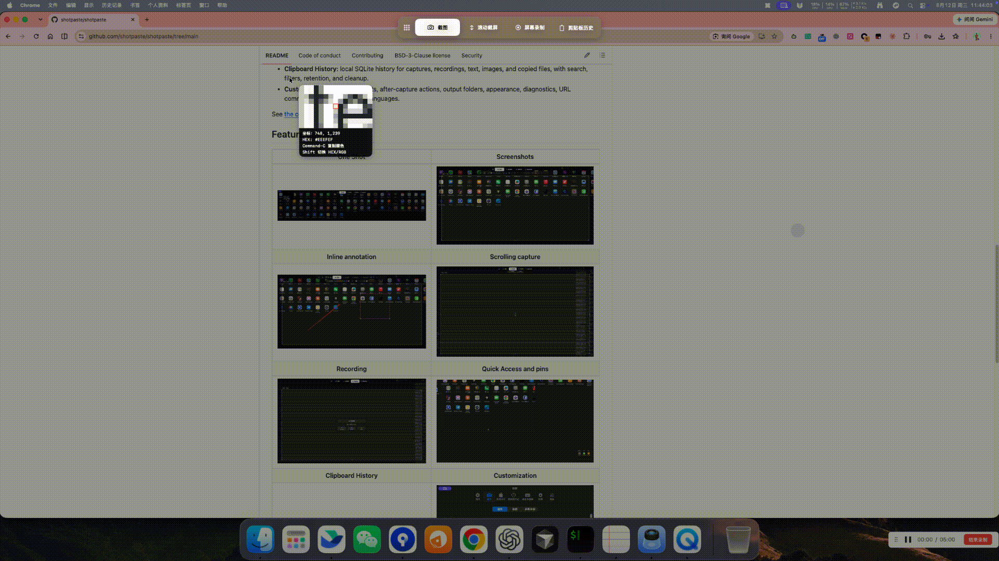
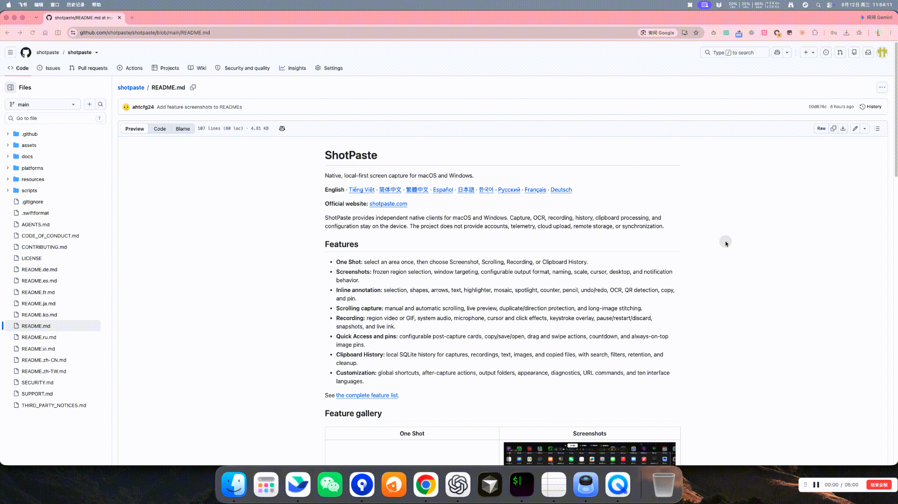
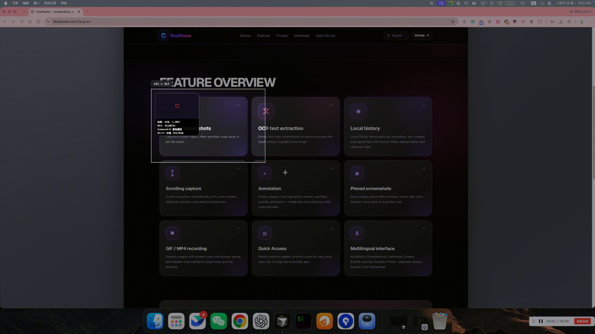
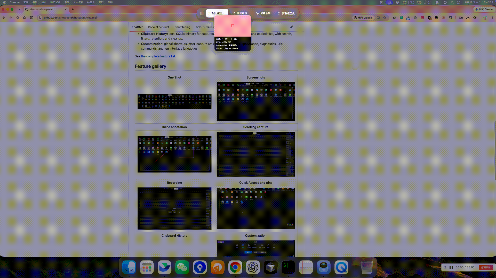
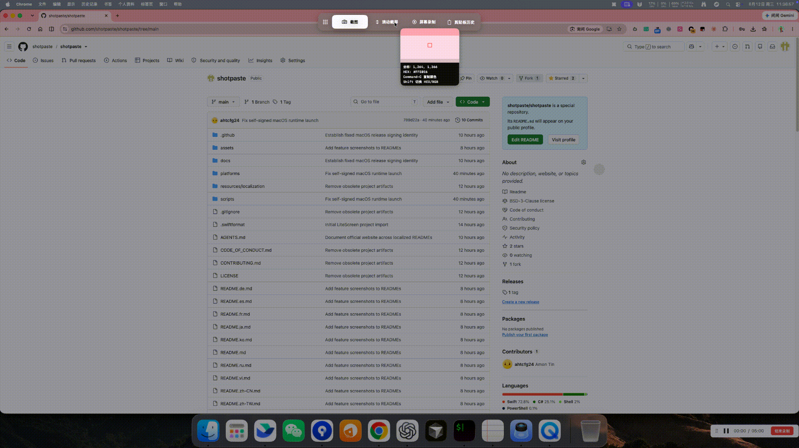
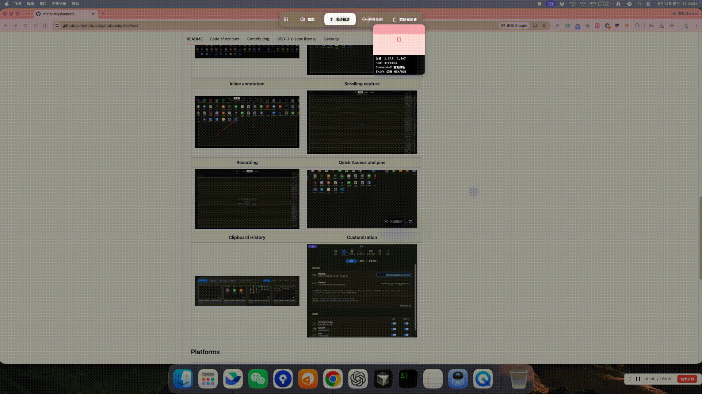
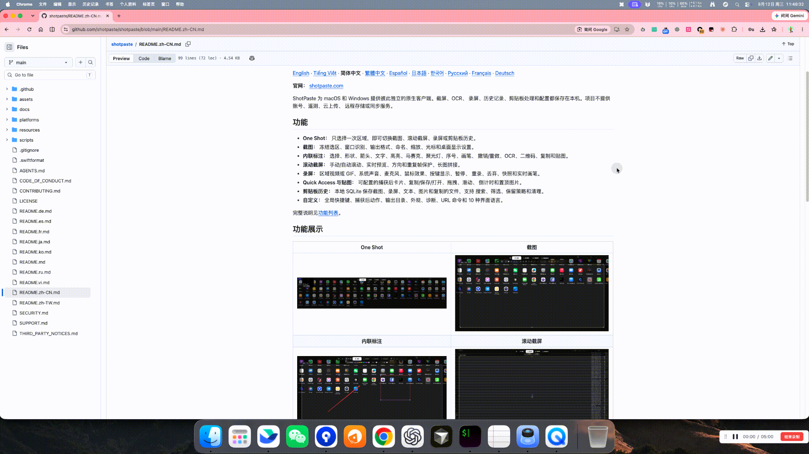
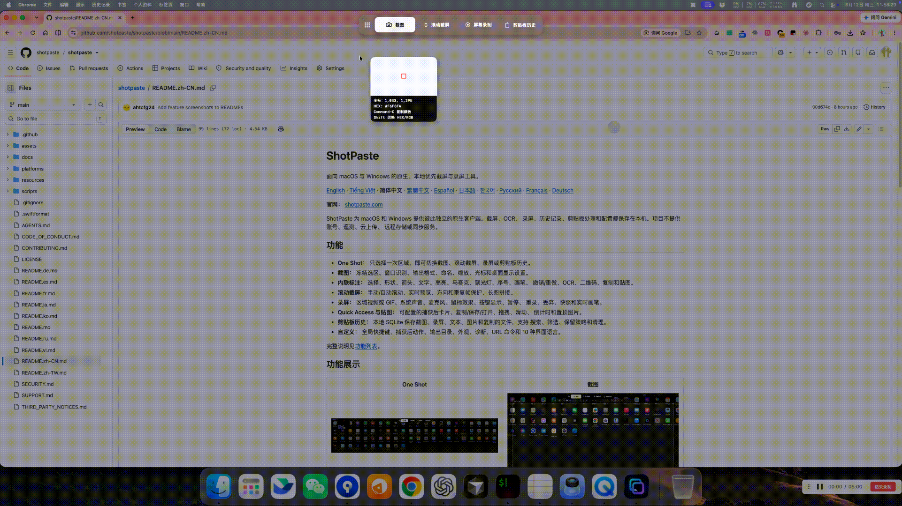
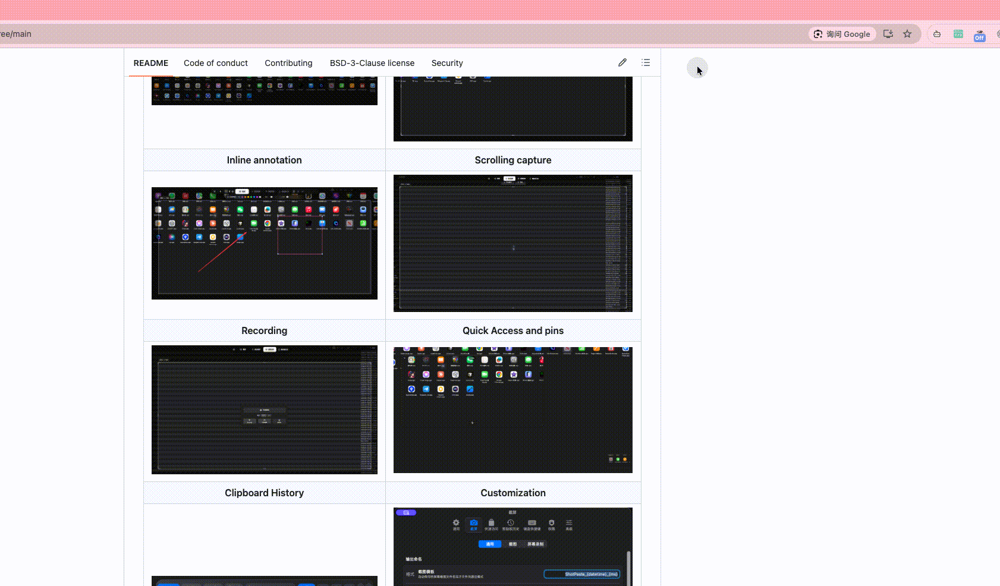
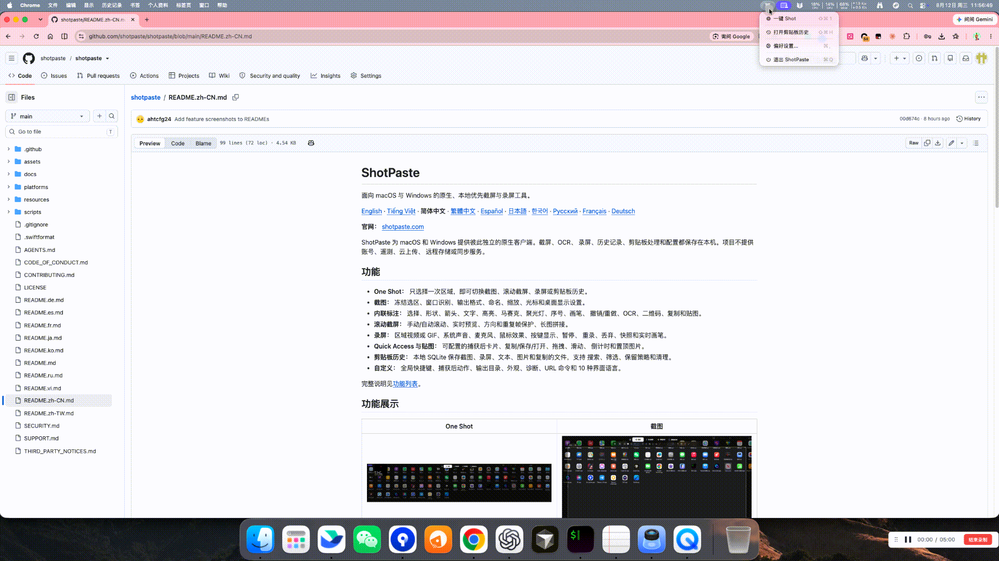

# ShotPaste

Captura y grabación de pantalla nativa y local para macOS y Windows.

[English](README.md) · [Tiếng Việt](README.vi.md) ·
[简体中文](README.zh-CN.md) · [繁體中文](README.zh-TW.md) · **Español** ·
[日本語](README.ja.md) · [한국어](README.ko.md) ·
[Русский](README.ru.md) · [Français](README.fr.md) ·
[Deutsch](README.de.md)

**Sitio web oficial:** [shotpaste.com](https://www.shotpaste.com/)

ShotPaste ofrece clientes nativos independientes para macOS y Windows. Las
capturas, el OCR, las grabaciones, el historial, el portapapeles y la
configuración permanecen en el dispositivo. El proyecto no ofrece cuentas,
telemetría, subida a la nube, almacenamiento remoto ni sincronización.

## Funciones

- **One Shot:** selecciona una zona una vez y elige Captura, Captura con
  desplazamiento, Grabación, Traducción o Historial del portapapeles.

  [](assets/readme/oneshot.gif)

- **Capturas y OCR:** selección congelada, detección de ventanas,
  reconocimiento de texto local, formato, nombres, escala, cursor y opciones
  del escritorio.

  [](assets/readme/OCR.gif)

- **Traducción:** traduce el texto de una zona One Shot congelada con OCR local,
  detección automática del idioma de origen, idiomas de destino configurables y
  un proveedor configurado por el usuario. Solo se envía el texto reconocido
  para traducirlo.

  [](assets/readme/translate.gif)

- **Anotación integrada:** selección, formas, flechas, texto, resaltador,
  mosaico, foco, contador, lápiz, deshacer/rehacer, QR, copiar y fijar.

  [](assets/readme/inline.gif)

- **Captura con desplazamiento:** desplazamiento manual/automático, vista
  previa, protección de dirección y duplicados, y unión de imágenes largas.

  [](assets/readme/scroll.gif)

- **Grabación:** vídeo de región o GIF, audio del sistema, micrófono, efectos
  del ratón, teclas, pausa, reinicio, descarte, instantáneas y tinta en vivo.

  [](assets/readme/recording.gif)

- **Quick Access y fijados:** tarjetas configurables, copiar/guardar/abrir,
  arrastrar, deslizar e imágenes siempre visibles.

  [](assets/readme/quickaccess-pin.gif)

  [](assets/readme/pin.gif)

- **Historial del portapapeles:** SQLite local para capturas, grabaciones,
  texto, imágenes y archivos, con búsqueda, filtros, retención y limpieza.

  [](assets/readme/clipboard-history.gif)

- **Personalización:** atajos globales, acciones posteriores, carpeta de salida,
  apariencia, diagnóstico, comandos URL y diez idiomas.

  [](assets/readme/settings.gif)

Consulta la [lista completa de funciones](docs/FEATURES.md).

## Plataformas

| | macOS | Windows |
| --- | --- | --- |
| Requisitos | macOS 13+, Apple Silicon | Windows 10 2004+, x64 |
| Tecnología nativa | SwiftUI, AppKit, ScreenCaptureKit, Vision | WPF, Win32 y API de captura/OCR/multimedia de Windows |
| Código | `platforms/mac` | `platforms/windows` |

Los clientes comparten el comportamiento del producto y los recursos de idioma,
pero no el código de la aplicación ni un framework de interfaz multiplataforma.

## Compilación

macOS:

```bash
./scripts/build_and_run.sh build
./scripts/run-tests.sh
```

Windows PowerShell:

```powershell
powershell.exe -NoProfile -ExecutionPolicy Bypass -File .\scripts\build-windows.ps1 -Configuration Debug
```

Consulta la [estructura y guía de compilación](docs/DEVELOPMENT.md).

## Descargas y licencia

Los paquetes actuales para macOS y Windows están en
[GitHub Releases](https://github.com/shotpaste/shotpaste/releases). ShotPaste
usa la [licencia BSD de 3 cláusulas](LICENSE).

### Agradecimientos e historial del código fuente

ShotPaste agradece a [Snapzy](https://github.com/duongductrong/Snapzy) y
[ShareX](https://github.com/ShareX/ShareX). Su trabajo de código abierto aportó
una ayuda e inspiración importantes durante el desarrollo de este proyecto.

El cliente para macOS partió del commit de Snapzy
[`a6f8edf01a48e9dd9bdc4212b0e3472725219274`](https://github.com/duongductrong/Snapzy/commit/a6f8edf01a48e9dd9bdc4212b0e3472725219274),
publicado bajo la licencia BSD de 3 cláusulas, y desde entonces ha divergido de
forma considerable. El cliente para Windows es una implementación nativa e
independiente del mismo flujo de producto de ShotPaste, basada en parte en el
estudio de ShareX.

Los textos obligatorios de copyright y licencia de terceros se conservan en
[THIRD_PARTY_NOTICES.md](THIRD_PARTY_NOTICES.md).

Consulta [CONTRIBUTING.md](CONTRIBUTING.md), [SUPPORT.md](SUPPORT.md) y
[SECURITY.md](SECURITY.md) para contribuir, pedir ayuda o informar de forma
responsable.
