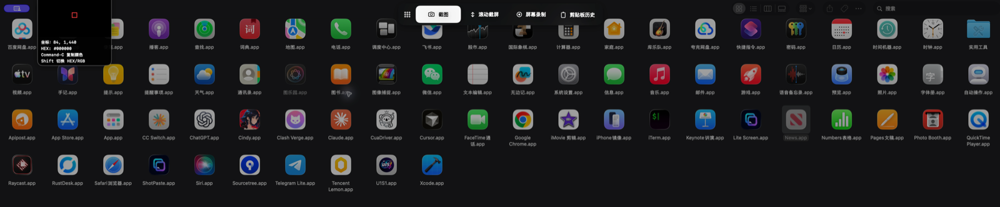
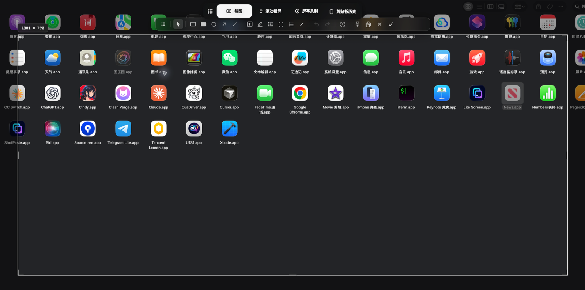
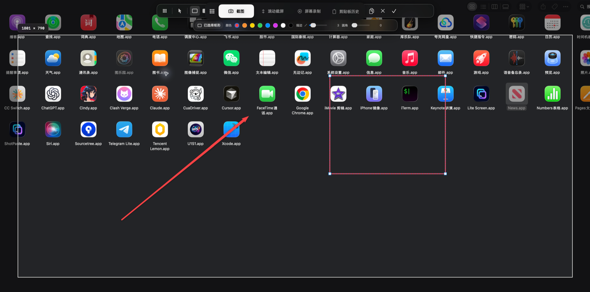
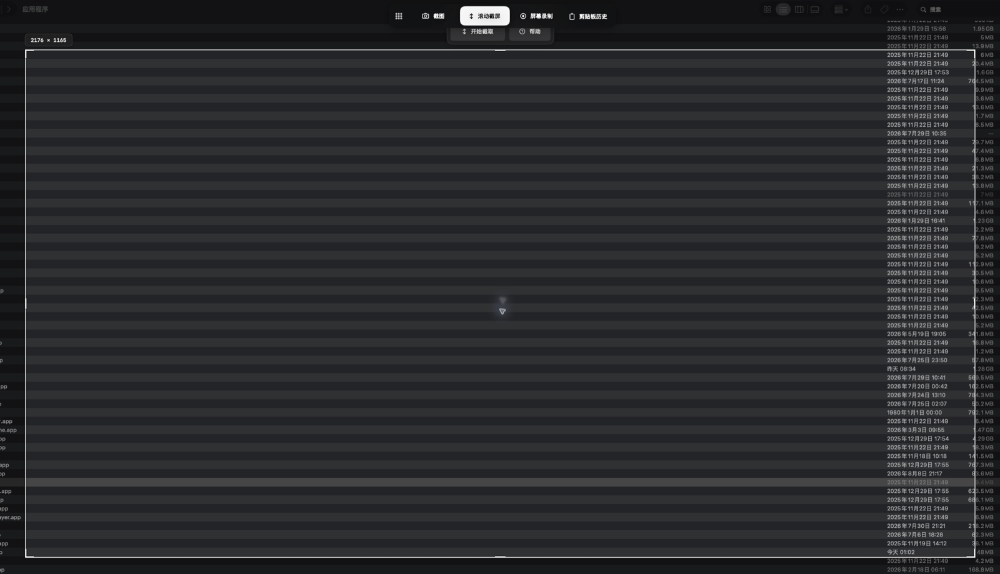
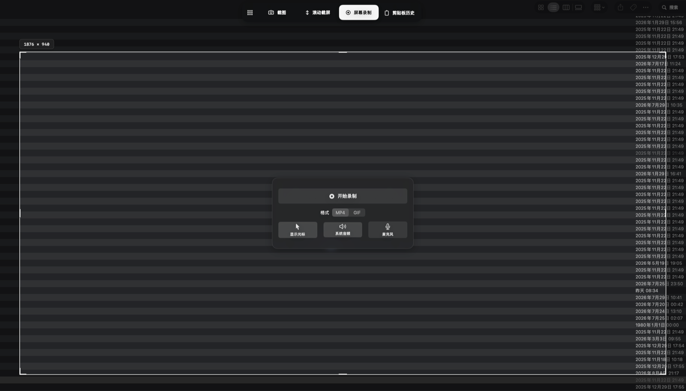
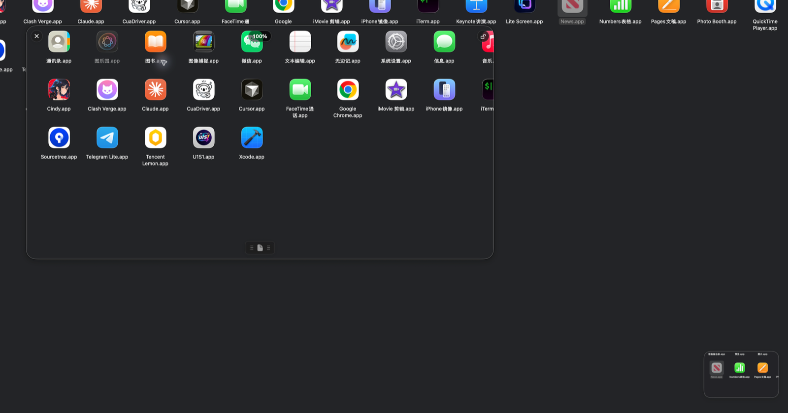
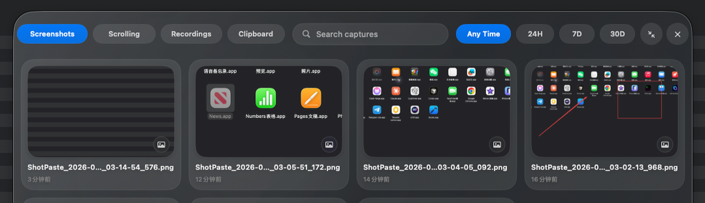
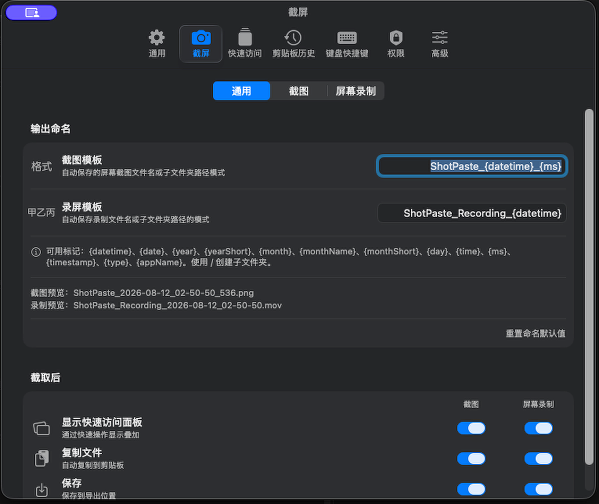

# ShotPaste

Công cụ chụp và ghi màn hình gốc, ưu tiên dữ liệu cục bộ cho macOS và Windows.

[English](README.md) · **Tiếng Việt** · [简体中文](README.zh-CN.md) ·
[繁體中文](README.zh-TW.md) · [Español](README.es.md) ·
[日本語](README.ja.md) · [한국어](README.ko.md) ·
[Русский](README.ru.md) · [Français](README.fr.md) ·
[Deutsch](README.de.md)

**Trang web chính thức:** [shotpaste.com](https://www.shotpaste.com/)

ShotPaste cung cấp hai ứng dụng gốc độc lập cho macOS và Windows. Ảnh chụp,
OCR, bản ghi, lịch sử, dữ liệu bảng tạm và cấu hình đều nằm trên thiết bị. Dự án
không cung cấp tài khoản, đo lường từ xa, tải lên đám mây, lưu trữ từ xa hay
đồng bộ.

## Tính năng

- **One Shot:** chọn vùng một lần rồi dùng Ảnh chụp, Chụp cuộn, Ghi màn hình
  hoặc Lịch sử bảng tạm.
- **Ảnh chụp:** vùng chọn đóng băng, nhận diện cửa sổ, định dạng, tên tệp, tỉ lệ,
  con trỏ và tùy chọn màn hình nền.
- **Chú thích trực tiếp:** vùng chọn, hình, mũi tên, chữ, tô sáng, mosaic, đèn rọi,
  số thứ tự, bút, hoàn tác/làm lại, OCR, QR, sao chép và ghim.
- **Chụp cuộn:** cuộn thủ công/tự động, xem trước trực tiếp, bảo vệ hướng và khung
  trùng, ghép ảnh dài.
- **Ghi màn hình:** video vùng hoặc GIF, âm thanh hệ thống, micrô, hiệu ứng chuột,
  hiển thị phím, tạm dừng, ghi lại, hủy, ảnh nhanh và vẽ trực tiếp.
- **Quick Access và ghim:** thẻ sau khi chụp có thể cấu hình, sao chép/lưu/mở,
  kéo thả, vuốt, đếm ngược và ảnh luôn nổi.
- **Lịch sử bảng tạm:** SQLite cục bộ cho ảnh, video, văn bản, hình và tệp đã sao
  chép, kèm tìm kiếm, bộ lọc, thời hạn lưu và dọn dẹp.
- **Tùy chỉnh:** phím tắt toàn cục, hành động sau khi chụp, thư mục đầu ra, giao
  diện, chẩn đoán, lệnh URL và 10 ngôn ngữ.

Xem [danh sách tính năng đầy đủ](docs/FEATURES.md).

## Thư viện tính năng

| **One Shot** | **Ảnh chụp** |
|:---:|:---:|
| [](assets/readme/one-shot.png) | [](assets/readme/screenshots.png) |
| **Chú thích trực tiếp** | **Chụp cuộn** |
| [](assets/readme/inline-annotation.png) | [](assets/readme/scrolling-capture.png) |
| **Ghi màn hình** | **Quick Access và ghim** |
| [](assets/readme/recording.png) | [](assets/readme/quick-access-pins.png) |
| **Lịch sử bảng tạm** | **Tùy chỉnh** |
| [](assets/readme/clipboard-history.png) | [](assets/readme/customization.png) |

## Nền tảng

| | macOS | Windows |
| --- | --- | --- |
| Yêu cầu | macOS 13+, Apple Silicon | Windows 10 2004+, x64 |
| Công nghệ gốc | SwiftUI, AppKit, ScreenCaptureKit, Vision | WPF, Win32, API chụp/OCR/đa phương tiện Windows |
| Mã nguồn | `platforms/mac` | `platforms/windows` |

Hai ứng dụng chia sẻ hành vi sản phẩm và tài nguyên bản địa hóa, không chia sẻ
mã ứng dụng hay khung UI đa nền tảng.

## Biên dịch

macOS:

```bash
./scripts/build_and_run.sh build
./scripts/run-tests.sh
```

Windows PowerShell:

```powershell
./scripts/build-windows.ps1 -Configuration Debug
```

Xem [cấu trúc dự án và hướng dẫn biên dịch](docs/DEVELOPMENT.md).

## Tải xuống và giấy phép

Các gói macOS và Windows mới nhất có tại
[GitHub Releases](https://github.com/shotpaste/shotpaste/releases). ShotPaste
dùng [Giấy phép BSD 3-Clause](LICENSE).

### Lời cảm ơn và lịch sử mã nguồn

ShotPaste trân trọng cảm ơn [Snapzy](https://github.com/duongductrong/Snapzy) và
[ShareX](https://github.com/ShareX/ShareX). Công trình mã nguồn mở của họ đã hỗ
trợ đáng kể và truyền cảm hứng trong quá trình phát triển dự án này.

Ứng dụng macOS bắt đầu từ commit Snapzy
[`a6f8edf01a48e9dd9bdc4212b0e3472725219274`](https://github.com/duongductrong/Snapzy/commit/a6f8edf01a48e9dd9bdc4212b0e3472725219274),
được phát hành theo Giấy phép BSD 3-Clause, và kể từ đó đã phát triển khác biệt
đáng kể. Ứng dụng Windows là một bản triển khai gốc độc lập của cùng quy trình
sản phẩm ShotPaste, đồng thời có tham khảo một phần từ việc nghiên cứu ShareX.

Các thông báo bản quyền và văn bản giấy phép bắt buộc của bên thứ ba được lưu
trong [THIRD_PARTY_NOTICES.md](THIRD_PARTY_NOTICES.md).

Xem [CONTRIBUTING.md](CONTRIBUTING.md), [SUPPORT.md](SUPPORT.md) và
[SECURITY.md](SECURITY.md) để đóng góp, nhận trợ giúp hoặc báo cáo có trách nhiệm.
