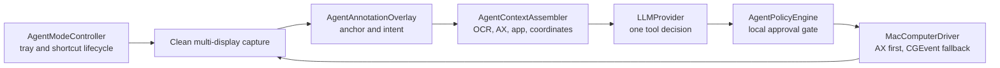

# Agent Mode (macOS MVP)

Agent Mode is a second ShotPaste product mode. One Shot captures content for the
user; Agent Mode uses a clean full-display capture as an observation, interprets
an intent, and performs a bounded sequence of locally approved Mac actions.

## Interaction

1. Turn on **Agent Mode** from the menu bar or Agent preferences.
2. Press **Option-A** (customizable). The shortcut is registered only while the
   mode is on, so it does not consume `å` or normal Option-A input while off.
3. ShotPaste captures and freezes every display while excluding its own UI.
4. Click an anchor, enter the task, then press Return. Shift-Return inserts a
   line break and Escape cancels.
5. The overlay closes before planning. Each action is followed by a new clean
   observation until the model completes, asks a question, fails, or is stopped.

After submission, a draggable translucent **Agent Activity** window appears on
the task display. It continuously shows the current phase and the auditable
observation, proposed action, approval, execution result, pause, completion, or
failure trail. It deliberately does not expose private model reasoning. Closing
the window only hides it; **Show Agent Activity** in the menu bar restores it.
Because it is a ShotPaste-owned window, it is excluded from every fresh Agent
observation and is never sent to the provider.

Any physical mouse, keyboard, drag, or scroll input pauses an executing Agent.
Escape remains the emergency stop while paused, and the menu bar always exposes
**Stop Agent Immediately** for an active session.

## Provider configuration

The default adapter uses a configurable OpenAI-compatible Chat Completions endpoint:

```text
endpoint = https://api3.wlai.vip/v1/chat/completions
model = gpt-5.6-luna
send_images = true
```

The endpoint, model, reasoning mode, and clean-image capability are editable, so
the Agent is not tied to a named LLM vendor. HTTPS endpoints and localhost HTTP
endpoints are accepted. The API token is stored directly in ShotPaste's application
preferences and is displayed only as a masked prefix/suffix. It remains absent
from TOML exports, diagnostics, and audit events. The settings UI can explicitly
import `SHOTPASTE_LLM_API_KEY` from the login shell; ShotPaste never reads shell
startup files as an implicit background action.

The current default model accepts tool calls and vision input, so clean screenshot
sending is on by default. It can be disabled for a text-only compatible provider;
ShotPaste still sends local Vision OCR, normalized anchor/display data, foreground
app/window data, and a sanitized Accessibility snapshot. The annotation anchor
and prompt UI are sent only as structured context and are never burned into the
image.

## Architecture and state



`AgentSessionCoordinator` owns the state machine:

```text
idle → capturing → annotating → observing → planning
     → awaitingApproval / awaitingUser → executing → observing
     → paused / completed / failed
```

`InteractionLeaseCoordinator` prevents Agent and One Shot sessions from owning
global interaction surfaces at the same time. The provider cannot approve its
own actions; the policy engine and native approval presenter are separate local
boundaries.

## MVP action and safety boundary

Allowed model tools are limited to activating a running app/window, click,
double-click, right-click, text input, key chords, scroll, drag, wait, ask the
user, and report completion. Accessibility actions are preferred; normalized
coordinate CGEvents are a fallback and are marked so the user-activity monitor
can distinguish Agent input from physical input.

The local client blocks secure-field and password entry. It asks for explicit
approval before crossing into another application or performing actions that
look like sending, uploading, purchasing, deleting, publishing, changing
security settings, submitting forms, or moving Finder items. Arbitrary shell,
AppleScript, file deletion tools, MCP, background autonomy, and long-running
unattended sessions are not exposed.

## Storage

Agent sessions do not use screenshot or clipboard history. Text events and safe
action summaries are written under the separate `AgentSessions` application
support directory. Typed text is represented only by character count in action
audit summaries. Observation screenshots remain ephemeral unless the user turns
on **Retain session screenshots**; retention is off by default.
