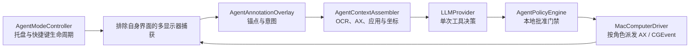

<a id="agent-mode-macos-mvp"></a>

# Agent Mode（macOS MVP）

**简体中文** · [English](AGENT_MODE.en.md)

Agent Mode 是 ShotPaste 的另一种产品模式。One Shot 为用户捕获内容；
Agent Mode 以排除自身界面的整屏捕获作为观察，理解意图，执行经过本地批准的有限 Mac 操作序列。

<a id="interaction"></a>

## 交互

1. 从菜单栏或 Agent 设置开启 **Agent Mode**。
2. 按 **Option-A**（可自定义）。仅模式开启时注册快捷键，关闭时不占用 `å` 或普通 Option-A 输入。
3. ShotPaste 捕获并冻结所有显示器，排除自身界面。
4. 点击锚点、输入任务，按 Return 提交。Shift-Return 换行，Escape 取消。
5. 规划前关闭叠层。每个操作后重新获取干净观察，直到模型完成、提问、失败或被停止。

提交后，任务所在显示器出现可拖动半透明 **Agent Activity** 窗口，
持续展示当前阶段及可审计的观察、提议操作、批准、执行结果、暂停、完成或失败记录，
不暴露模型私有推理。关闭仅隐藏窗口，可通过菜单栏 **Show Agent Activity** 恢复。
此窗口属于 ShotPaste，自每次新观察中排除，不发送到供应商。

真实鼠标、键盘、拖拽或滚动输入会暂停执行中的 Agent。
暂停时 Escape 仍可紧急停止，活动会话期间菜单栏始终提供 **Stop Agent Immediately**。

<a id="provider-configuration"></a>

## 供应商配置

Agent 支持两种可选上游协议，通过 TOML 的 `api_protocol` 或 Agent 设置中的 **API protocol** 选择：

- `openai`：OpenAI 兼容 Chat Completions（默认）。

  ```text
  endpoint = http://192.168.31.67:8317/v1
  model = gpt-5.6-luna
  send_images = true
  ```

  默认本地 Token 为 `123456`。请求时将 `/v1` 基础 URL 规范为 `/v1/chat/completions`。

- `anthropic`：Anthropic Messages API（`POST /v1/messages`，
  `x-api-key` / `Authorization: Bearer` 鉴权，`anthropic-version: 2023-06-01`）。

  ```text
  endpoint = https://api.anthropic.com
  model = claude-sonnet-5
  send_images = true
  ```

  端点可以是主机、带版本的基础地址、任意网关前缀或完整 Messages URL。
  例如 `https://api.kimi.com/coding/` 解析为 `https://api.kimi.com/coding/v1/messages`，
  已有 `/v1/messages` 后缀保持不变。

开启 Anthropic thinking 时，ShotPaste 请求 adaptive thinking 和 high effort。
若兼容网关以 HTTP 400 明确拒绝新字段，仅使用旧 token-budget 格式重试一次；
其它错误请求不换协议重试。关闭 thinking 时显式发送 disabled。
禁用并行工具调用，本地拒绝包含多个工具操作的响应。

协议、端点、模型、推理模式及干净图像能力可编辑，不绑定特定 LLM 供应商。
允许 HTTPS、本机 localhost HTTP 及默认可信局域网端点。
设置中保存的 Token 优先于环境变量与本地默认值，只以掩码前后缀展示，
不进入 TOML 导出、诊断或审计事件。
设置界面可显式从登录 shell 导入 `SHOTPASTE_LLM_API_KEY`；
ShotPaste 不在后台隐式读取 shell 启动文件。

当前默认模型支持工具与视觉，因此默认发送干净截图。
兼容纯文字供应商时可关闭图像发送；应用仍发送本地 Vision OCR、归一化锚点/显示器数据、
前台应用/窗口信息及脱敏辅助功能快照。标注锚点与提示界面仅作为结构化上下文发送，不绘入图像。

<a id="architecture-and-state"></a>

## 架构与状态



`AgentSessionCoordinator` 拥有状态机：

```text
idle → capturing → annotating → observing → planning
     → awaitingApproval / awaitingUser → executing → observing
     → paused / completed / failed
```

`InteractionLeaseCoordinator` 防止 Agent 与 One Shot 同时占有全局交互界面。
供应商不能批准自己的操作；策略引擎与原生批准界面是独立的本地边界。

<a id="mvp-action-and-safety-boundary"></a>

## MVP 操作与安全边界

模型工具仅限激活正在运行的应用/窗口、单击、双击、右击、输入文字、组合键、滚动、拖拽、等待、
向用户提问和报告完成。优先使用辅助功能操作，归一化坐标 CGEvent 作为回退。
行、分组、静态标签等依赖区域的自定义界面，通过辅助功能元素做语义定位和策略判断，
再派发指针 CGEvent，让应用走与真实鼠标相同的命中测试。
按钮等原生语义控件仍优先 AXPress。CGEvent 带标记，便于区分 Agent 与真实输入。
操作结果只确认输入已派发，规划模型必须在下一次新观察中验证预期状态。

本地客户端阻止安全字段和密码输入。跨应用，以及看似发送、上传、购买、删除、发布、
修改安全设置、提交表单或移动 Finder 项目的操作，均需显式批准。
不暴露任意 shell、AppleScript、文件删除工具、MCP、后台自主运行或长时间无人值守会话。

<a id="storage"></a>

## 存储

Agent 会话不使用截图或剪贴板历史。文字事件与安全操作摘要写入独立的
`AgentSessions` 应用支持目录。审计摘要仅以字符数表示输入文字。
观察截图默认临时存在；仅在用户开启 **Retain session screenshots** 后保留，该选项默认关闭。
